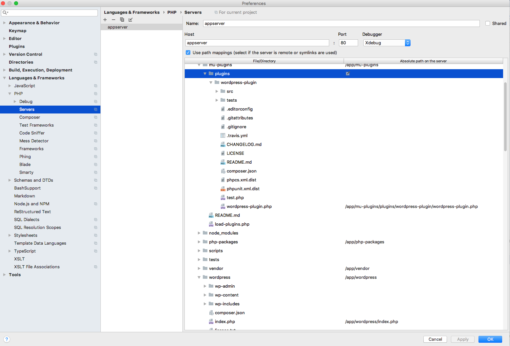

## The Local Development Environment
The supplied local development environment is dependent on Lando, and therefore on Docker. Lando provides WordPress, WP-CLI, xdebug, mailhog, phpmyadmin, etc.

[The documentation about installing Lando](https://docs.devwithlando.io/installation/installing.html) has OS-specific instructions for installing Docker.

* Install Lando
    - https://docs.devwithlando.io/installation/installing.html
* Start server
    - `lando start`
* Go to [https://caldera.lndo.site](https://caldera.lndo.site) and dismiss the HTTPS warning.

## Setup xdebug in phpStorm

* Setup path mappings.
    - In preferences, find PHP servers.
    - Add appserver.
    - Map `/wordpress` to `/app/wordpress`
    - Map `/php-packages` to `/app/php-packages`
    - Map `/wordpress/index.php` to `/app/wordpress/index.php`
    - Map `/mu-plugins` to `/app/mu-plugins`
    - Map `/mu-plugins/plugins/wordpress-plugin/wordpress-plugin.php` to `/app/mu-plugins/plugins/wordpress-plugin/wordpress-plugin.php`
* Turn on debug listening -- phone icon.

## Links

* https://joshpress.net/create-a-wordpres-site-with-lando/
* https://docs.devwithlando.io
* https://xdebug.org/
